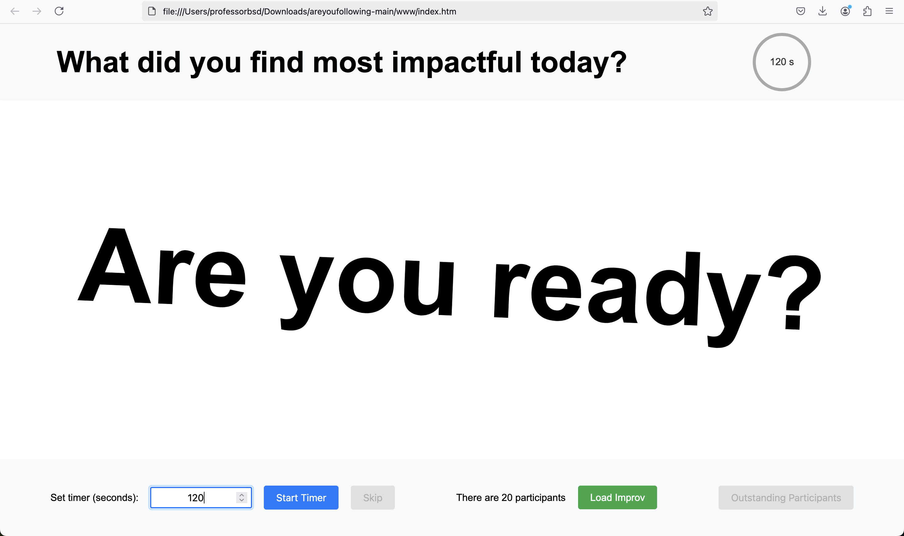
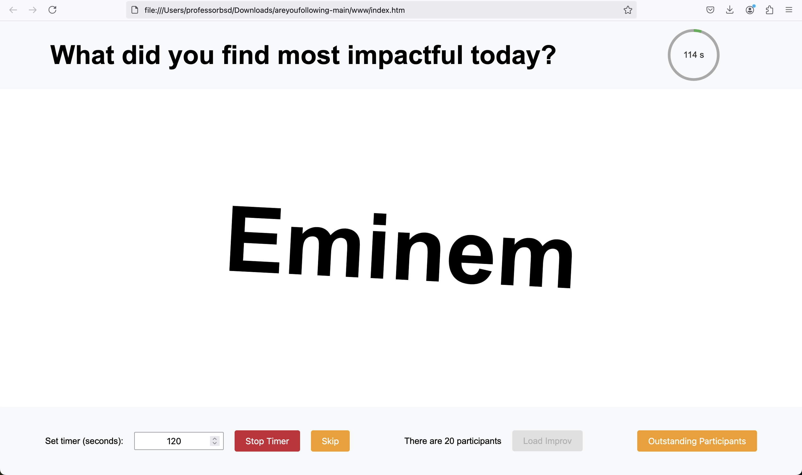

**Are you following?**
================

A simple static web application that displays a random name from a predefined list for a configurable amount of time, cycling through the list until a total configurable time has elapsed.

## Features

* Displays a random name from a configurable list
* Timed display: names are shown for a specified duration (configurable)
* Total time control: specify how long the application should run before stopping
* Randomized naming cycle to keep things fresh

## Configuration

You can customize the behavior of the application by uploading a JSON file with the following structure:

```json
{
  "message": "What did you find most impactful today?",
  "shift": 45,
  "participants": [
    "participant1",
    "participant2",
    ...
    "participantN",
  ]
}
```

### Building configuration files with LLMs

Any LLM can help you build this configuration file easily. Let's suppose the following list of names coming from a CSV file:

Billie Eilish
Beyoncé
Cristiano Ronaldo
Ariana Grande
Shakira
Jennifer Lopez
Tom Cruise
Dwayne Johnson
Brad Pitt
Justin Bieber
Angelina Jolie
Selena Gomez
Keanu Reeves
Will Smith
Eminem
Zendaya
Drake
Scarlett Johansson
George Clooney
Kylie Jenner

The following prompt should create the needed configuration file (or something close to it):

```text
Can you please create a JSON configuration file called areyoufollowing.json similar to the sample one below based on the list of names shared as well and with a shift of 52 seconds?

{
  "message": "What did you find most impactful today?",
  "shift": 45,
  "participants": [
    "participant1",
    "participant2",
    ...
    "participantN",
  ]
}

Billie Eilish
Beyoncé
Cristiano Ronaldo
Ariana Grande
Shakira
Jennifer Lopez
Tom Cruise
Dwayne Johnson
Brad Pitt
Justin Bieber
Angelina Jolie
Selena Gomez
Keanu Reeves
Will Smith
Eminem
Zendaya
Drake
Scarlett Johansson
George Clooney
Kylie Jenner
```

## How it works

1. Simply clone or download this repository.
2. Open the `index.html` file inside the `www` folder in your favorite web browser.
3. Load the JSON file with the *question*, *shift duration* in seconds and *the list of participants*.
4. Specify the **total time of the exercise** and press the *Start button*.
  
5. The application will start displaying random names, cycling through the list until the specified total time has elapsed.
  

### Dealing with outstanding participants


If you want to use `areyoufollowing` in your courses, you might benefit from the following two additional features:

- Getting the configuration with the list of outstanding participants and using it in future classes: Once the time is up, or if you stop it manually, the *Outstanding Participants* button will download such a file.
- Skipping the current participant if they're not present: Skipped participants are added to the list of outstanding participants; therefore, they'll be considered in the future.

## Contributing

Feel free to submit pull requests or raise issues if you'd like to add features or fix bugs!

Note: This is a static web application, so there's no server-side code involved. Just open `index.html` and go!